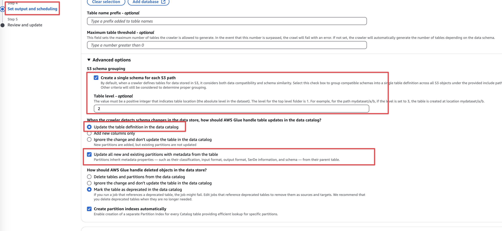

# AWS Glue Visual ETL - Sales Data Pipeline

This project demonstrates how to build a **code-free data pipeline** using **AWS Glue Studio's Visual ETL**. It simulates a real-world sales data transformation: from raw CSV in S3 → to cleaned and enriched Parquet files in another S3 location.

### Use Case

- Raw sales data is ingested daily into `s3://hack-with-harsha-sales-data/data/raw_sales/` as CSV.
- Catalog this data using crawler.
- We clean the data:
  - Remove rows with missing `order_id`
  - Convert `order_date` to timestamp
  - Convert multiple currencies (EUR, INR, GBP) to USD
- Final output is written as **Parquet** files to `s3://hack-with-harsha-sales-data/data/clean_sales/`

### Tech Stack

- AWS Glue Studio (Visual ETL)
- Amazon S3 (Source and Target)
- Python + Faker (for dummy data generation)
- AWS CLI / boto3 for S3 upload

### Sample Data Generation

Generate sample data using Python script `main.py`. This script creates csv files with order data and partitions them by service, year, month, and day.

Install the dependencies listed in the `requirements.txt` file. You can do this using pip:

```bash
>>> python3 -m pip install -r requirements.txt
```

Then run the script:

```bash
>>> python main.py 
```

Install `awscli` if you haven't already to proceed with following steps.

And then run `aws configure` to configure awscli with `secret key` and `access key`.

### Amazon S3

Create an `S3 Bucket` to store the generated files. You can do this using the `awscli`.

```bash
>>> aws s3 mb s3://hack-with-harsha-sales-data
```

Upload the `generated files` using `aws s3 sync` command.

```bash
>>> aws s3 sync ./data s3://hack-with-harsha-sales-data/data/raw_sales/ --exclude "*" --include "*.csv"
```

### AWS Glue Crawler

Use `Glue Crawler` to automatically discover schema and create tables in the `Data Catalog`.

For this, we need to create a role for glue to access the S3 bucket.

> [!IMPORTANT]
> Try to understand `trust-policy.json` file.. Here, we are attaching this role to `Glue`. so that, only `Glue` can assume this role.

```bash
>>> aws iam create-role \
  --role-name AWSGlueServiceRoleForSales \
  --assume-role-policy-document file://trust-policy.json \
  --description "IAM Role for AWS Glue Crawler"
```

Attach AWS Managed `Glue Service Role` Policy to the newly created role. This will allow `crawler` interact with other Glue components like the `Data Catalog`.

```bash
>>> aws iam attach-role-policy \
  --role-name AWSGlueServiceRoleForSales \
  --policy-arn arn:aws:iam::aws:policy/service-role/AWSGlueServiceRole
```

Put the `Inline Policy` to the `Role`

```bash
>>> aws iam put-role-policy \
  --role-name AWSGlueServiceRoleForSales \
  --policy-name GlueCrawlerS3Access \
  --policy-document file://glue-crawler-s3-policy.json
```

This is optional, If you want add `tagging` for cost and maintenance purposes.

```bash
>>> aws iam tag-role \
  --role-name AWSGlueServiceRoleForSales \
  --tags Key=Environment,Value=Production Key=Service,Value=GlueCrawler
```

Create a Glue Crawler

```bash
>>> aws glue create-crawler \
  --name sales-crawler \
  --role AWSGlueServiceRoleForSales \
  --database-name sales_db \
  --targets '{"S3Targets": [{"Path": "s3://hack-with-harsha-sales-data/data/"}]}'
```

Now, we go to console and edit the crawler like in the screenshot.



- Check ✅ the option `Create a single schema for each S3 path`.
- Set `Table level` to 3
  - `data/${table_name}/` → Level 3 (create tables at this level)
  - `data/${table_name}/${year}/...` → If set to 3, it groups tables by year (not recommended for our case).

With `Table level = 3`, AWS Glue will:

- Create one table per `${table_name}`
- Automatically detect `year`, `month`, `day` as partitions.

Run the crawler

```bash
>>> aws glue start-crawler --name sales-crawler
```

Once complete, the crawler will create tables like `raw_sales`, `clean_sales`, etc. with the proper schema inferred from the csv files.

Now, time to query the sales directly using Athena.

### Schedule Crawler

Create scheduled crawlers to keep the schema updated as formats evolve

```bash
# Runs every 6 hours
>>> aws glue update-crawler \
  --name sales-crawler \
  --schedule "cron(0 */6 * * ? *)"
```

### AWS Glue Studio

- Go to Glue Studio Console
- Create a new **Visual ETL Job**
- Set **raw_sales** table in the glue catalog as source.
- Apply the following transforms:

  * **Filter**: Remove rows with null `order_id`
  * **Map**: Convert `order_date` to timestamp
  * **Currency Standardization** (CASE logic in expression)
- Set **S3 (Parquet)** as target → `s3://hack-with-harsha-sales-data/data/clean_sales/`

### **Steps in AWS Glue Studio (Visual ETL)**

#### 1. **Source: Amazon Glue Catalog**

* Choose "Glue Catalog" as the **source**.
* Point to the `raw_sales` table.

#### 2. **ApplyTransform: Filter**

* Condition: `order_id IS NOT NULL`
  *use `SQL Query` tool*

  ```sql
  select * from myDataSource
  WHERE order_id is not null
  ```

#### 3. **ApplyTransform: Map**

* **Transform `order_date`**: Convert string to timestamp. Tool name is **to_timestamp**

  ```python
  to_timestamp(order_date, "yyyy-MM-dd")
  ```
* **Derived Colum `amount`**:
  Use a conditional expression like:

  ```sql
  CASE
    WHEN currency == \"USD\" THEN amount
    WHEN currency == \"EUR\" THEN amount * 1.1
    WHEN currency == \"INR\" THEN amount / 82
  END
  ```

#### 4. **DropFields** (Optional)

* Drop original `currency` and `amount` fields if no longer needed.

#### 5. Make Sure Your Dataset Includes Partition Columns

* Columns like `year`, `month`, `day` **must exist in your transformed schema**.
* If you're deriving them from `order_date`, you can **add them using a Map or ApplyMapping transform**.

Example:

```python
year = year(order_date)
month = lpad(month(order_date), 2, "0")
day = lpad(day(order_date), 2, "0")
```

#### 6. **Target: Amazon S3**

- Choose "Amazon S3" as the **target**.
- Output path: `s3://hack-with-harsha-sales-data/data/clean_sales/`
- Format: Parquet (efficient for analytics)

#### 7. Enable Partitioning in Target Node

In the **S3 Target Node settings**:

* Scroll to **"Partition Keys"**
* Add: `year`, `month`, `day` (exactly matching the column names)
* Glue will automatically write to partitioned folders like:

  ```
  .../year=2025/month=05/day=07/part-*.parquet
  ```

### **Schedule**

* Trigger this job on a daily basis using a **Glue Workflow** or **EventBridge rule**.